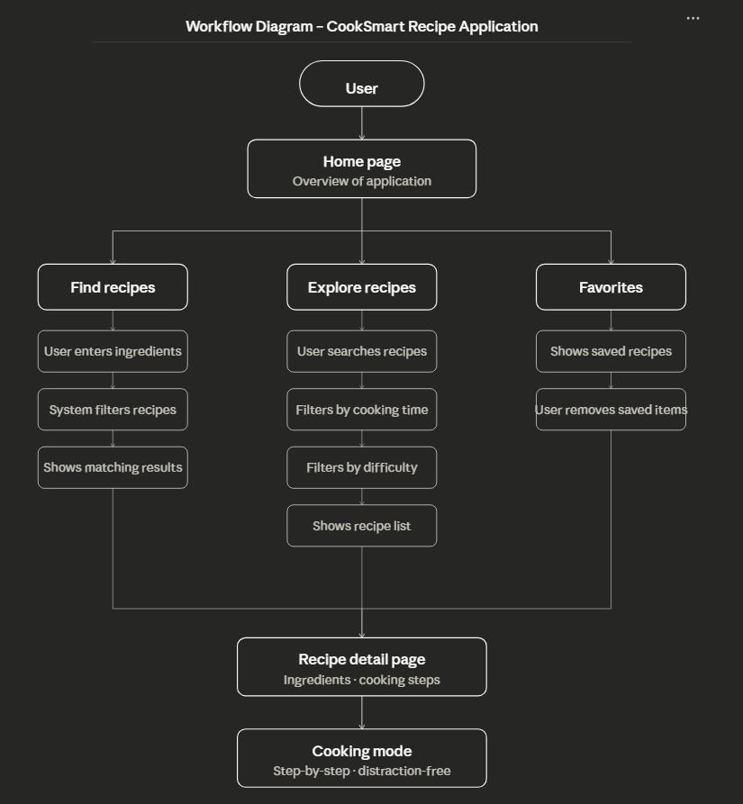

# CookSmart

CookSmart is a React recipe discovery website that helps users find meals based on ingredients they already have, explore recipes with filters, save favorites, and follow step-by-step cooking instructions in a clean interface.

## Live Website

Hosted on Vercel: [https://cooksmart-react.vercel.app/](https://cooksmart-react.vercel.app/)

## Workflow Diagram



## Features

- Ingredient-based recipe finder with live suggestions
- Recipe explorer with instant search and filtering
- Favorites saved with localStorage
- Recipe detail pages with cooking mode
- Dark and light theme toggle
- Responsive modern UI

## Tech Stack

- React
- React Router
- Vite
- JavaScript
- HTML
- CSS

## How It Works

1. Users enter ingredients they already have.
2. CookSmart matches recipes based on available ingredients.
3. Users can refine recipes through search and filters.
4. Recipes can be opened in detail view and followed step by step.
5. Favorite recipes are stored locally for quick access later.

## Local Development

1. Install dependencies:

```bash
npm install
```

2. Start the development server:

```bash
npm run dev
```

3. Create a production build:

```bash
npm run build
```

4. Preview the production build locally:

```bash
npm run preview
```

## Project Structure

```text
src/
  components/   Reusable UI components
  data/         Recipe dataset
  pages/        Route-level pages
  utils/        Shared search and ingredient helpers
docs/
  workflow.png  Workflow diagram
```

## Highlights

- Shared reusable card, list, and form components
- Theme support using CSS variables
- Local state management with React hooks
- Fast client-side routing with React Router

## Author

Harshit Singh  
24BCI0100
